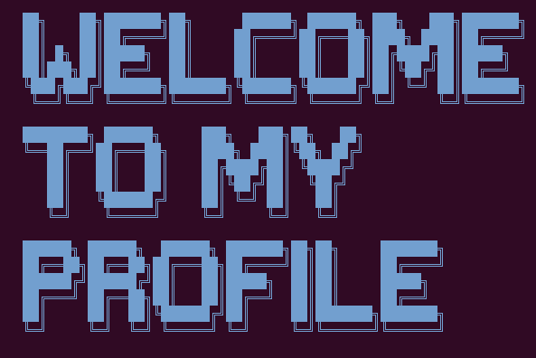

### Dynamic links, Stats

 

🔭 I’m currently working on:

  

  

## 🧰 Languages and Tools:

## Skills

<!--
**obonhamcarter/obonhamcarter** is a ✨ _special_ ✨ repository because its `README.md` (this file) appears on your GitHub profile.
### Hi there 👋

Make badges at: https://shields.io/category/version

Here are some ideas to get you started:

- 🔭 I’m currently working on ...
- 🌱 I’m currently learning ...
- 👯 I’m looking to collaborate on ...
- 🤔 I’m looking for help with ...
- 💬 Ask me about ...
- 📫 How to reach me: ...
- 😄 Pronouns: ...
- ⚡ Fun fact: ...
-->
